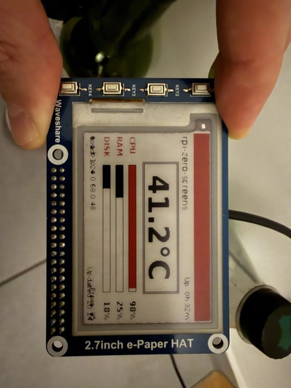
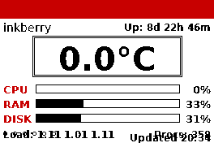
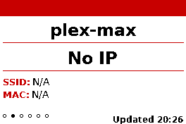
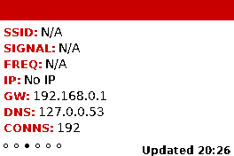
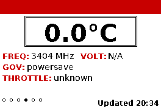
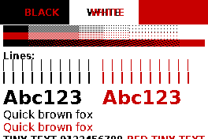

# Pi E-Ink Dashboard

Tri-color utility dashboard for the **Waveshare 2.7" e-Paper HAT (B) V1** on Raspberry Pi Zero W.

Six information screens rendered in black, white, and red — navigated with the four physical buttons on the HAT. Designed for always-on headless operation with a 3-minute auto-refresh cycle.

<p align="center">
  
</p>

## Screens

| # | Screen | Description |
|---|--------|-------------|
| 1 | **Dashboard** | System overview — hero temperature, CPU/RAM/DISK progress bars, load average, uptime |
| 2 | **Identity** | Large hostname and IP address — the #1 thing you need from a headless Pi |
| 3 | **Network** | SSID, signal strength, frequency, gateway, DNS, connection count |
| 4 | **Health** | CPU deep dive — temperature with decorative frame, frequency, voltage, governor, throttle flags |
| 5 | **Test Pattern** | Programmatic BWR color test — solid blocks, dithered gradients, line widths, text sizes |
| 6 | **Art** | Generative tri-color art — cycles through Voronoi mosaic, concentric geometry, and tile grid algorithms |

<p align="center">
  
  
  
  <br>
  
  
  
</p>

## Hardware

| Component | Details |
|-----------|---------|
| Display | Waveshare 2.7" e-Paper HAT (B) **V1** — 264x176 pixels, black/white/red |
| Target | Raspberry Pi Zero W Rev 1.1 (ARMv6, Raspbian Trixie) |
| Interface | SPI (via spidev) + GPIO (via RPi.GPIO) |
| Refresh | ~15 seconds per full update |
| Buttons | 4 physical keys on HAT (active-low, directly on GPIO) |

### Pin Mapping

| Function | GPIO (BCM) | Notes |
|----------|-----------|-------|
| RST | 17 | Display reset |
| DC | 25 | Data/Command select |
| BUSY | 24 | Busy status (V1: LOW=busy, HIGH=idle) |
| CS | 8 (CE0) | Managed by spidev, not GPIO |
| KEY1 | 5 | Previous screen |
| KEY2 | 6 | Next screen |
| KEY3 | 13 | Force refresh |
| KEY4 | 19 | Toggle auto-cycle |

## Quick Start

### On the Raspberry Pi

```bash
# Clone
git clone <repo-url> ~/developer/pi-eink-dashboard
cd ~/developer/pi-eink-dashboard

# One-command install (enables SPI, installs deps, creates venv, starts service)
./install.sh
```

That's it. The dashboard starts automatically and survives reboots.

### Development (any Linux machine)

```bash
# Render all screens as PNG previews — no Pi hardware needed
cd src
python -m pi_eink_dashboard.main --demo
# Output: demo_output/*_preview.png
```

## Button Controls

| Button | Action | Behavior |
|--------|--------|----------|
| **KEY1** | Previous screen | Wraps from screen 1 to screen 6 |
| **KEY2** | Next screen | Wraps from screen 6 to screen 1 |
| **KEY3** | Force refresh | Re-renders and redraws the current screen |
| **KEY4** | Toggle auto-cycle | When ON, advances to next screen every 3 minutes |

## Architecture

### Two-Phase Main Loop

```
RENDER ──> POLL ──> RENDER ──> POLL ──> ...
```

1. **RENDER**: Compose screen into dual 1-bit buffers (black + red), send to EPD via SPI (~15s)
2. **POLL**: Sleep 200ms between checks for button presses. After 3 minutes with no input, loop back to RENDER (auto-refreshes current screen, or advances if auto-cycle is on)

### Display Pipeline

```
Screen.draw()           264x176 landscape, grayscale ("L")
       |
  Composer.result()     Convert to 1-bit ("1"), no dithering
       |
  Display.show()        Rotate 90° CCW → 176x264 portrait
       |
  EPD.getbuffer()       Pack pixels into bit buffer (V1 polarity: 1=ink)
       |
  EPD.display()         Send byte-by-byte over SPI (cmd 0x10=black, 0x13=red)
```

### Dual-Buffer Composer

All drawing goes through `Composer`, which manages two separate image layers:

- **Black layer**: pixels where black ink is applied
- **Red layer**: pixels where red ink is applied
- Where neither has ink → white
- Where both have ink → black overrides on physical display

Text is rendered on **grayscale** images for clean FreeType anti-aliasing, then threshold-converted to 1-bit at the final step. This produces sharp text at all sizes on the low-resolution e-ink display.

## Project Structure

```
pi-eink-dashboard/
├── src/pi_eink_dashboard/
│   ├── main.py                 # Entry point, render/poll loop
│   ├── display.py              # EPD wrapper (init, show, clear, sleep)
│   ├── composer.py             # Dual-buffer grayscale→1-bit renderer
│   ├── input.py                # 4-button GPIO handler (gpiozero, debounce)
│   ├── dither.py               # Atkinson tri-color dithering
│   ├── driver/
│   │   ├── epd2in7b.py         # V1 hardware driver (byte-by-byte SPI)
│   │   └── epdconfig.py        # SPI + GPIO hardware config (RPi.GPIO)
│   └── screens/
│       ├── base.py             # BaseScreen, fonts, layout constants
│       ├── dashboard.py        # Screen 1: System overview
│       ├── identity.py         # Screen 2: Hostname + IP
│       ├── network.py          # Screen 3: WiFi details
│       ├── health.py           # Screen 4: CPU health
│       ├── test_pattern.py     # Screen 5: BWR color test
│       └── art.py              # Screen 6: Generative art
├── install.sh                  # One-command Pi setup
├── uninstall.sh                # Remove systemd service
├── pi-eink-dashboard.service   # systemd unit template
├── pyproject.toml
├── CLAUDE.md                   # AI assistant instructions
└── docs/                       # Screenshots and photos
```

## Service Management

```bash
# Status
sudo systemctl status pi-eink-dashboard

# Logs (live)
journalctl -u pi-eink-dashboard -f

# Stop / Start / Restart
sudo systemctl stop pi-eink-dashboard
sudo systemctl start pi-eink-dashboard
sudo systemctl restart pi-eink-dashboard

# Disable auto-start
sudo systemctl disable pi-eink-dashboard

# Uninstall
./uninstall.sh
```

## Dependencies

All dependencies come from `apt` — no pip packages required.

| Package | Purpose |
|---------|---------|
| `python3-pil` | Image rendering (Pillow) |
| `python3-psutil` | System metrics (CPU, RAM, disk, network) |
| `python3-spidev` | SPI bus communication |
| `python3-rpi.gpio` | GPIO pin control for display |
| `python3-gpiozero` | GPIO button input (higher-level API) |
| `python3-venv` | Virtual environment with `--system-site-packages` |
| `fonts-dejavu-core` | DejaVu Sans font family |
| `wireless-tools` | `iwgetid` / `iwconfig` for WiFi info |

## Deployment from Dev Machine

```bash
# Sync code to Pi (preserves venv on Pi)
rsync -avz --exclude='.venv' --exclude='__pycache__' --exclude='.git' \
  ~/developer/pi-eink-dashboard/ gaiar@192.168.0.248:~/developer/pi-eink-dashboard/

# Restart service on Pi
ssh gaiar@192.168.0.248 "sudo systemctl restart pi-eink-dashboard"
```

## Adding a New Screen

1. Create `src/pi_eink_dashboard/screens/myscreen.py`:

```python
from ..composer import Composer
from .base import BaseScreen, FONT_BODY, CONTENT_TOP, MARGIN

class MyScreen(BaseScreen):
    title = "MY SCREEN"  # shown in red header banner

    def draw(self, composer: Composer) -> None:
        y = CONTENT_TOP + 4
        composer.text((MARGIN, y), "Hello, e-ink!", FONT_BODY, color="black")
```

2. Register in `main.py`:

```python
from .screens.myscreen import MyScreen

screens = [
    ...
    MyScreen(),
]
```

For fullbleed screens (no header/footer), set `fullbleed = True` and leave `title = ""`.

## Hard-Won Lessons (V1 Hardware)

These lessons were learned through painful debugging. Future maintainers, take heed:

### V1 vs V2 — Completely Different Protocols

The Waveshare 2.7" e-Paper HAT (B) exists in **two incompatible hardware revisions**. Using a V2 driver on V1 hardware produces garbage on the display. Key differences:

| | V1 (this project) | V2 |
|-|---|---|
| BUSY pin | LOW = busy, HIGH = idle | HIGH = busy, LOW = idle |
| Black data | Command `0x10` | Command `0x24` |
| Red data | Command `0x13` | Command `0x26` |
| LUT tables | Required (custom waveforms) | Not needed (built-in) |
| Bit polarity | 1 = ink, 0 = no ink | Opposite |

### Byte-by-Byte SPI Transfer is Mandatory

The V1 hardware **does not work** with bulk SPI transfers (`writebytes2()`). Data must be sent one byte at a time via `send_data()`. Attempting bulk transfer produces random noise on the display. This was the single hardest bug to find — the bulk API works fine on V2 and on other SPI devices.

```python
# WRONG — produces display garbage on V1
self.send_data2(image_buffer)

# CORRECT — works on V1
for i in range(len(image_buffer)):
    self.send_data(image_buffer[i])
```

### RPi.GPIO, Not gpiozero, for the Display

The display driver must use `RPi.GPIO` directly (matching the original Waveshare `epdif.py`). Adapting it to `gpiozero` causes subtle timing and initialization issues that produce corrupted output. The button input handler uses `gpiozero` fine — it's only the display SPI/GPIO that requires `RPi.GPIO`.

### CS Pin Conflict

On modern Raspberry Pi OS (Bookworm/Trixie), `RPi.GPIO` uses `lgpio` internally. Calling `GPIO.setup(8, GPIO.OUT)` on the CE0 pin conflicts with `spidev` which already owns that pin. Solution: don't configure CS via GPIO — let spidev handle it.

### Font Rendering on 1-Bit Images

Drawing text directly on PIL mode `"1"` (1-bit) images produces garbled small text because FreeType's anti-aliased output gets harshly thresholded. Solution: render on mode `"L"` (grayscale) and convert to `"1"` with `dither=NONE` at the end. Also, at 264x176 resolution, font sizes below 12px bold are unreadable — all fonts use bold weights with a minimum size of 12px.

### The Service Runs as Root

`RPi.GPIO` requires root access for `/dev/gpiomem`. The systemd service runs as root (no `User=` directive). This is the standard approach for GPIO-based Pi services.

## License

MIT
